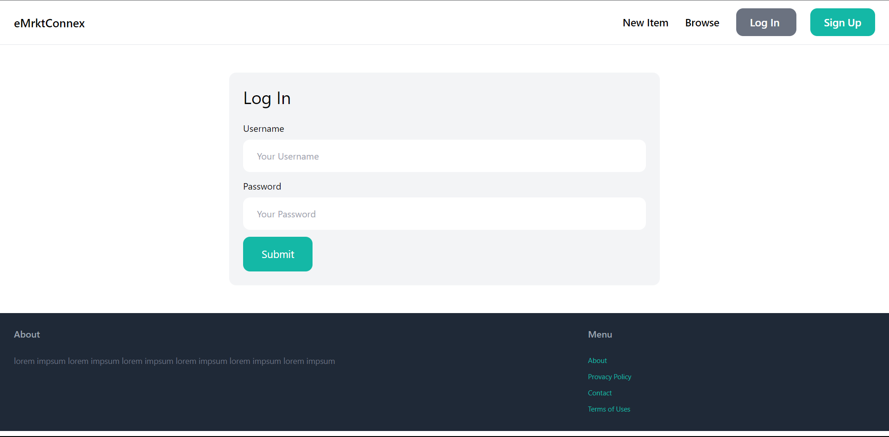
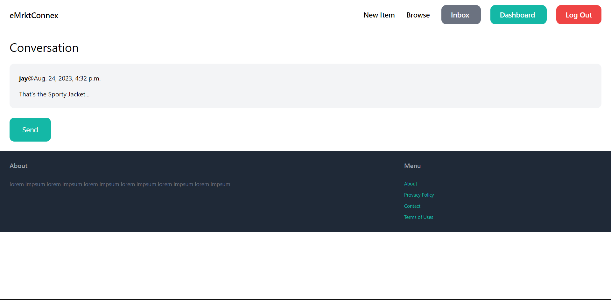
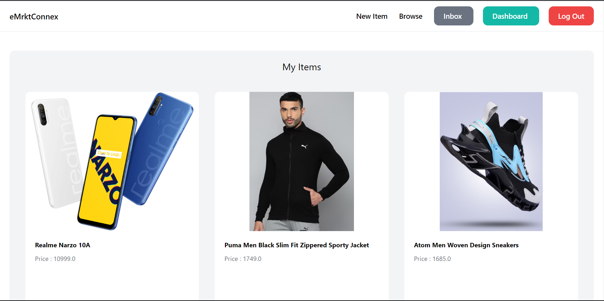
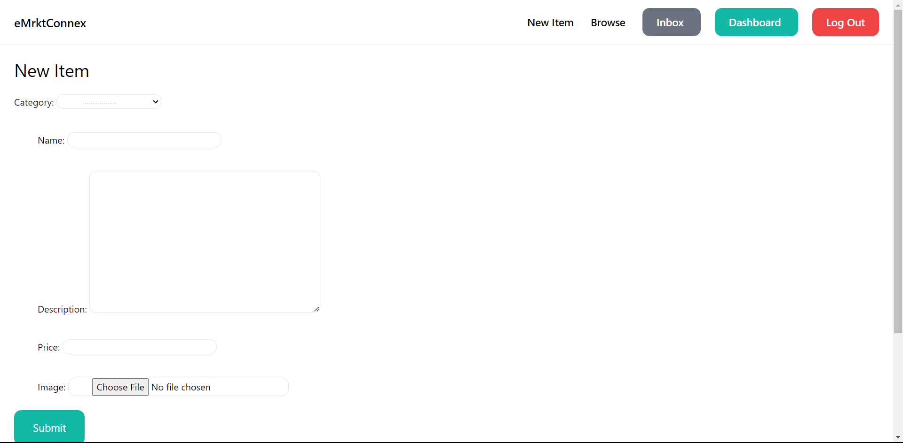

# eMarketConnex

With the basics of Django building a simple online marketplace where people can buy and sell items. It is made with 
- Authentication

- Communication between users

- Dashboard for your items

- Form handling and customizations

